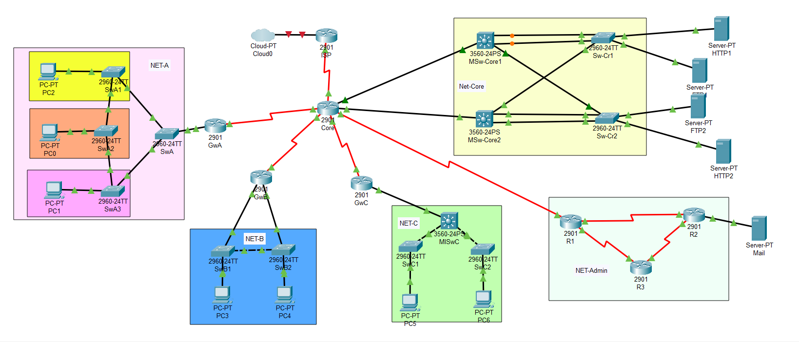

<h2>
    CCNA Project Simulation
</h2>

 

<h3> 👨‍💻⚙️ &nbsp; First time I simulate a real Network with these protocol and Services: </h3>

 

 
 

- EIGRP
- OSPF 
    - with 2 Area
    - PPP Wan
    - Chap
- HA
- DHCP
- GRE
- EtherChannel
- NAT
- STP (Spanning Tree)
    - Use Protections
- SSH
- HTTP (with Backup server)
- FTP (with Backup server)
- Mail Server
- Extended AccessList On Core-Router
- Use Vlans and Needed Protocol
 
 
 
<h4>I hope useful for you ;) </h4>
<h4> Happy Learning  🌱✍️⚡️ </h4>